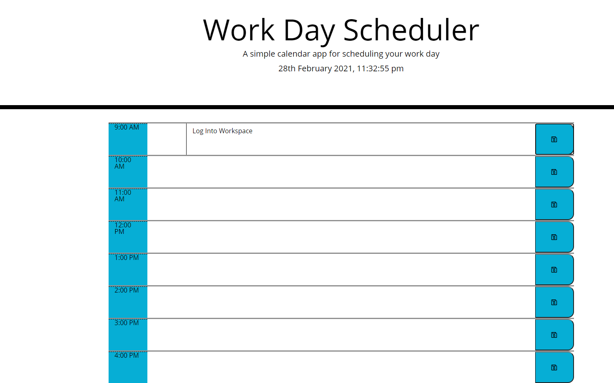

# Weekday Scheduler

- [Description](#Description)
- [Introduction-Demo](#Introduction-Demo)
- [Functionality](#Functionality)
- [GitHub](#GitHub)
- [Technologies-used](#Technologies-used)

# Description

A simple calendar application that allows the user to save an event for each hour in their day.

# Introduction Demo

This application uses the jQuery library to manipulate the HTML elements base on the user's input click events. It also users LocalStorage to store the appointments on click and renders it on the window when the page loads.

# Functionality

The Work Day Scheduler calendar presents a 9AM to 5PM day. The current date is being displayed at the top of the planner. Each of the workday’s hours are colored based on the current time of day. Hours which are in the past are being colored grey, hours in the present is colored red and hours in the future are colored green.

# GitHub 
https://github.com/AnnieGlade4327/weekday-scheduler

# Technologies used

1. [Moment.js](https://momentjs.com/)
2. [Bootstrap] (https://getbootstrap.com/) - styling framework
3. HTML
4. CSS
5. JavaScript
